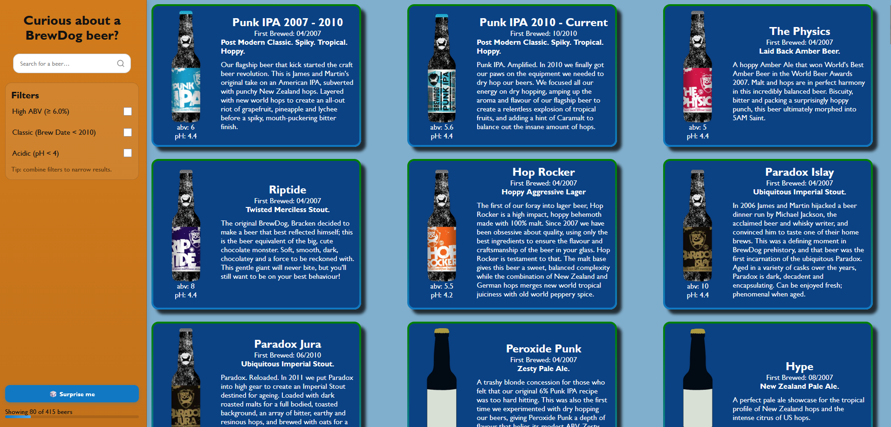

# 🍺 Punk API

A responsive React application for exploring and filtering **BrewDog’s DIY Dog beer catalog**, originally built during weeks 7-8 of the software development course at \_nology.

Originally, this application used the **[Brewdog Punk API](https://punkapi.com/)**, however, unfortuntely that has now been decommissioned by Brewdog.

Now, it connects to the **[PunkAPI v3](https://punkapi.online/v3/)** — a FastAPI-based digital archive of BrewDog beers kindly developed and served by [alxiw](https://github.com/alxiw/punkapi/tree/master).



## 🔍 Features

- **Search** by beer name
- **Filter** beers by:
  - High ABV (> 6%)
  - Classic range (brewed before 2010)
  - Acidic profile (pH < 4)
- **Random beer** feature — get surprised by a random brew
- Responsive **desktop + mobile** layout
- Smooth UI with **SCSS** styling and hover animations
- Pagination for browsing the full catalog

## 🧱 Project Structure

```text
PUNK-API/
├─ public/
├─ src/
│  ├─ assets/
│  │  └─ images/              # Static assets (beer.svg, readme_head.png)
│  ├─ components/
│  │  ├─ Navbar/              # Sidebar with search + filters
│  │  ├─ FiltersList/         # Checkbox filter list
│  │  ├─ Card/                # Individual beer cards
│  │  └─ CardList/            # Paginated beer grid
│  ├─ App.jsx                 # App shell + layout
│  ├─ main.jsx                # Entry point for Vite
│  ├─ index.html
│  ├─ index.scss              # Global styles
│  └─ App.scss                # Layout-specific styling
├─ package.json
└─ vite.config.js
```

## 🚀 Tech Stack

- React (via Vite)
- SCSS / CSS 3
- HTML 5
- [PunkAPI v3](https://github.com/alxiw/punkapi/tree/master)

## Getting Started

### Install dependencies

```
npm install
```

### Run locally

```
npm run dev
```

### Build for production

```
npm run build
```

### Preview the build

```
npm run preview
```

### Deployment

Deployed to GitHub Pages using the gh-pages package.

```
npm run predeploy
npm run deploy
```
